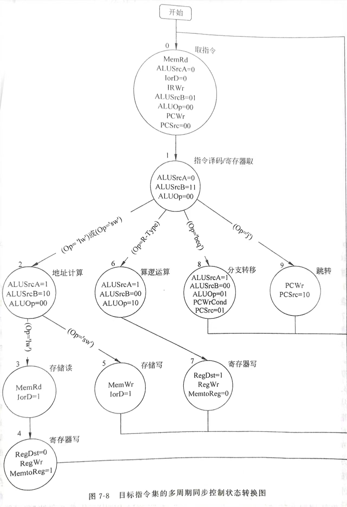

# MIPS32 多周期报告


## 数据通路

完全按照书上数据通路。编写10条多周期指令。

## MCU与状态机
mcu控制状态用PLA实现。




## 组成部件
大部分与单周期部件相同。由于多周期指令与数据可以一起存放在DM中，用状态机的IorD区分，故删除IM部件中的取值，改为IR部件。单周期对比多周期，大部分都没有改动。只是把单周期中CU改为PLA实现。同时新增了一个状态寄存器，两个临时寄存器存储中间数据，以及四路选择器部件。下面只展示新增部件。

+ IR
```verilog
`timescale 1ns/1ps
module IR (
    input clk,
    input W_Enable,
    input [31:0] Data,
    output reg [5:0] OP_Code,
    output reg [4:0] Rs,
    output reg [4:0] Rt,
    output reg [4:0] Rd,
    output reg [4:0] Shamt,
    output reg [5:0] Func,
    output reg [15:0] Imm16,
    output reg [25:0] Addr26
);
    reg [31:0] Inst;
    always @(*) begin
        if (W_Enable == 1)
            Inst <= Data;
    end
    always @(posedge clk) begin
        OP_Code <= Inst[31:26];
        Rs <= Inst[25:21];
        Rt <= Inst[20:16];
        Rd <= Inst[15:11];
        Shamt <= Inst[10:6];
        Func <= Inst[5:0];
        Imm16 <= Inst[15:0];
        Addr26 <= Inst[25:0];
    end
endmodule
```
+ MCU
完全按照书上的PLA实现MCU。
```verilog
`timescale 1ns/1ps
module MCU (
    input [5:0] OP_Code,
    input [3:0] S,
    output PCWr,
    output PCWrCond,
    output IorD,
    output MemRd,
    output MemWr,
    output IRWr,
    output MemtoReg,
    output [1:0] PCSrc,
    output [1:0] ALUOp,
    output [1:0] ALUSrcB,
    output ALUSrcA,
    output RegWr,
    output RegDst,
    output [3:0] NS
);
    wire [16:0] Status;
    assign Status[16] = !S;
    assign Status[15] = !S[3:1] & S[0];
    assign Status[14] = !S[3:2] & S[1] & !S[0];
    assign Status[13] = !S[3:2] & !(~S[1:0]);
    assign Status[12] = !S[3] & !(~S[2]) & !S[1:0];
    assign Status[11] = !S[3] & S[2] & !S[1] & S[0];
    assign Status[10] = !S[3] & !(~S[2:1]) & !S[0];
    assign Status[9] = !S[3] & !(~S[2:0]);
    assign Status[8] = S[3] & !S[2:0];
    assign Status[7] = S[3] & !S[2:1] & S[0];
    assign Status[6] = !OP_Code[5:2] & OP_Code[1] &!OP_Code[0] & !S[3:1] & S[0];
    assign Status[5] = !OP_Code[5:3] & OP_Code[2] & !OP_Code[1:0] & !S[3:1] & S[0];
    assign Status[4] = !OP_Code & !S[3:1] & S[0];
    assign Status[3] = OP_Code[5] & !OP_Code[4:2] & !(~OP_Code[1:0]) & !S[3:2] & S[1] & !S[0];
    assign Status[2] = OP_Code[5] & !OP_Code[4] & OP_Code[3] & !OP_Code[2] & !(~OP_Code[1:0]) & !S[3:1] & S[0];
    assign Status[1] = OP_Code[5] & !OP_Code[4:2] & !(~OP_Code[1:0]) & !S[3:1] & S[0];
    assign Status[0] = OP_Code[5] & !OP_Code[4] & OP_Code[3] & !OP_Code[2] & !(~OP_Code[1:0]) & !S[3:2] & S[1] & !S[0];

    assign PCWr = Status[16] | Status[7];
    assign PCWrCond = Status[8];
    assign IorD = Status[13] | Status[11];
    assign MemRd = Status[16] | Status[13];
    assign MemWr = Status[11];
    assign IRWr = Status[16];
    assign MemtoReg = Status[12];
    assign PCSrc[1] = Status[7];
    assign PCSrc[0] = Status[8];
    assign ALUOp[1] = Status[10];
    assign ALUOp[0] = Status[8];
    assign ALUSrcB[1] = Status[15] | Status[14];
    assign ALUSrcB[0] = Status[16] | Status[15];
    assign ALUSrcA = Status[14] | Status[10] | Status[8];
    assign RegWr = Status[12] | Status[9];
    assign RegDst = Status[9];
    assign NS[3] = Status[6] | Status[5];
    assign NS[2] = Status[13] | Status[10] | Status[4] | Status[0];
    assign NS[1] = Status[10] | Status[4] | Status[3] | Status[2] | Status[1] ;
    assign NS[0] = Status[16] | Status[10] | Status[6] | Status[3] | Status[0];
    
endmodule
```

+ MUX32_4
四路选择器
```verilog
`timescale 1ns/1ps
module MUX32_4 (
    input [1:0] Ctrl,
    input [31:0] i0,
    input [31:0] i1,
    input [31:0] i2,
    input [31:0] i3,
    output [31:0] out
);
    always @* begin
        case (Ctrl)
            2'b00: 
                out = i0;
            2'b01: 
                out = i1;
            2'b10: 
                out = i2;
            default: 
                out = i3;
        endcase
    end

endmodule
```
+ SR
状态寄存器
```verilog
`timescale 1ns/1ps
module SR (
    input clk,
    input [3:0] NS,
    output reg [3:0] S
);
    initial begin
        S = 0;
        #10;
    end
    always @(posedge clk ) begin
        S <= NS;
    end
    
endmodule
```
+ TmpR
```verilog
`timescale 1ns/1ps
module TmpR (
    input clk,
    input [31:0] Data,
    output reg[31:0] Output
);
    always @(posedge clk) begin
        Output <= Data;
    end
    
endmodule
```
+ Multi
多周期数据通路
```verilog
`timescale 1ns/1ps
module Multi (
    input clk,
    input reset
);// page321
    wire [31:0] Inst, PC_in, PC_out;
    wire [31:0] RF_R_data1, RF_R_data2, RF_W_data;
    wire [31:0] DM_Addr, DM_R_data, DM_W_data;
    wire [31:0] SHL32_in, SHL32_out;
    wire [31:0] MUX32_21_i0, MUX32_21_i1, MUX32_21_out;
    wire [31:0] MUX32_22_i0, MUX32_22_i1, MUX32_22_out;
    wire [31:0] MUX32_23_i0, MUX32_23_i1, MUX32_23_out;
    wire [31:0] MUX32_41_i0, MUX32_41_i1, MUX32_41_i2, MUX32_41_i3, MUX32_41_out;
    wire [31:0] MUX32_42_i0, MUX32_42_i1, MUX32_42_i2, MUX32_42_i3, MUX32_42_out;
    wire [31:0] Sig32;
    wire [31:0] A_in, A_out, B_in, B_out, ALUOut_in, ALUOut_out, MDR_in, MDR_out;
    wire [31:0] ALU_a, ALU_b, ALU_c;
    wire [27:0] SHL26_out;
    wire [25:0] Addr26, SHL26_in;
    wire [15:0] Imm16, Sig16;
    wire [5:0] OP_Code, Func, ALUCU_funct;
    wire [4:0] RF_R_Reg1, RF_R_Reg2, RF_W_Reg;
    wire [4:0] Rs, Rt, Rd, Shamt;
    wire [4:0] MUX5_i0, MUX5_i1, MUX5_out;
    wire [3:0] S, NS;
    wire [2:0] ALUCtrl, ALU_mod;
    wire [1:0] ALUOp, PCSrc, ALUSrcB;
    wire [1:0] MUX32_41_c, MUX32_42_c;
    wire PCWr, PCWrCond, IorD, MemRd, MemWr, IRWr, MemtoReg, ALUSrcA, RegWr, RegDst;
    wire RF_W, DM_R, DM_W, ALU_z, ALU_o; 
    wire MUX32_21_ctrl, MUX32_22_ctrl, MUX32_23_ctrl, MUX5_ctrl, PC_W;

    assign ALU_a = MUX32_21_out;
    assign ALU_b = MUX32_42_out;
    assign ALU_mod = ALUCtrl;
    assign ALUCU_funct = Func;
    assign DM_Addr = MUX32_22_out;
    assign DM_W_data = B_out;
    assign DM_R  = MemRd;
    assign DM_W = MemWr;
    assign Inst = DM_R_data;
    assign MUX5_ctrl = RegDst;
    assign MUX5_i0 = Rt;
    assign MUX5_i1 = Rd;
    assign MUX32_21_ctrl = ALUSrcA;
    assign MUX32_21_i0 = PC_out;
    assign MUX32_21_i1 = A_out;
    assign MUX32_22_ctrl = IorD;
    assign MUX32_22_i0 = PC_out;
    assign MUX32_22_i1 = ALUOut_out;
    assign MUX32_23_ctrl = MemtoReg;
    assign MUX32_23_i0 = ALUOut_out;
    assign MUX32_23_i1 = MDR_out;
    assign MUX32_41_c = PCSrc;
    assign MUX32_41_i0 = ALU_c;
    assign MUX32_41_i1 = ALUOut_out;
    assign MUX32_41_i2 = {{PC_out[31:28]}, {SHL26_out}};
    assign MUX32_42_c = ALUSrcB;
    assign MUX32_42_i0 = B_out;
    assign MUX32_42_i1 = 4;
    assign MUX32_42_i2 = Sig32;
    assign MUX32_42_i3 = SHL32_out;
    assign PC_in = MUX32_41_out;
    assign PC_W = PCWr | (PCWrCond & ALU_z);
    assign RF_W = RegWr;
    assign RF_W_data = MUX32_23_out;
    assign RF_W_Reg = MUX5_out;
    assign RF_R_Reg1 = Rs;
    assign RF_R_Reg2 = Rt;
    assign SHL26_in = Addr26;
    assign SHL32_in = Sig32;
    assign Sig16 = Imm16;
    assign A_in = RF_R_data1;
    assign B_in = RF_R_data2;
    assign ALUOut_in = ALU_c;
    assign MDR_in = DM_R_data;

    ALU alu(ALU_a, ALU_b, ALU_c, ALU_mod, ALU_z, ALU_o);
    ALUCU alucu(ALUOp, ALUCU_funct, ALUCtrl);
    DM dm(.R_Enable(DM_R), .W_Enable(DM_W), .Addr(DM_Addr), .R_data(DM_R_data), .W_data(DM_W_data), .IorD(IorD));
    IR ir(.clk(clk), .W_Enable(IRWr), .Data(Inst), .OP_Code(OP_Code), .Rs(Rs), .Rt(Rt), .Rd(Rd), .Shamt(Shamt), .Func(Func), .Imm16(Imm16), .Addr26(Addr26));
    MCU mcu(.OP_Code(OP_Code), .S(S), .NS(NS), .PCSrc(PCSrc), .PCWr(PCWr), .PCWrCond(PCWrCond), .IorD(IorD), .IRWr(IRWr), .ALUOp(ALUOp), .ALUSrcA(ALUSrcA), .ALUSrcB(ALUSrcB), .RegDst(RegDst), .RegWr(RegWr), .MemtoReg(MemtoReg), .MemRd(MemRd), .MemWr(MemWr));
    MUX5 mux5(MUX5_ctrl, MUX5_i0, MUX5_i1, MUX5_out);
    MUX32_2 mux32_21(MUX32_21_ctrl, MUX32_21_i0, MUX32_21_i1, MUX32_21_out);
    MUX32_2 mux32_22(MUX32_22_ctrl, MUX32_22_i0, MUX32_22_i1, MUX32_22_out);
    MUX32_2 mux32_23(MUX32_23_ctrl, MUX32_23_i0, MUX32_23_i1, MUX32_23_out);
    MUX32_4 mux32_41(MUX32_41_c, MUX32_41_i0, MUX32_41_i1, MUX32_41_i2, MUX32_41_i3, MUX32_41_out);
    MUX32_4 mux32_42(MUX32_42_c, MUX32_42_i0, MUX32_42_i1, MUX32_42_i2, MUX32_42_i3, MUX32_42_out);
    PC pc(clk, reset, PC_W, PC_in, PC_out);
    RF rf(.clk(clk), .W_Enable(RF_W), .W_Reg(RF_W_Reg), .W_data(RF_W_data), .R_Reg1(RF_R_Reg1), .R_Reg2(RF_R_Reg2), .R_data1(RF_R_data1), .R_data2(RF_R_data2));
    SHL2_26 shl2_26(SHL26_in, SHL26_out);
    SHL2_32 shl2_32(SHL32_in, SHL32_out); 
    SigExt sigext(Sig16, Sig32);
    SR sr(.clk(clk), .NS(NS), .S(S));
    TmpR regA(clk, A_in, A_out), regB(clk, B_in, B_out), ALUOut(clk, ALUOut_in, ALUOut_out);
    MDR mdr(clk, MDR_in, MDR_out);

endmodule
```

## 波形图
1. 转移指令
对于jmp与beq。可以很清楚的看到PCSrc=0, PCSrc=10与01的波形变化。分别经过取指、译码与跳转/分支转移三个周期。


2. R型

对于R型指令。可以看到ALUOp在周期变换，取0/2。相比转移指令多了一个寄存器写周期。


3. I型

I型指令。前三个周期和其他的指令差不多。LW多了最后的存储读与寄存器写周期，SW多了存储写周期。在这里IorD信号在取内存值的之后跳变到1。检查过信号都与状态机匹配。

