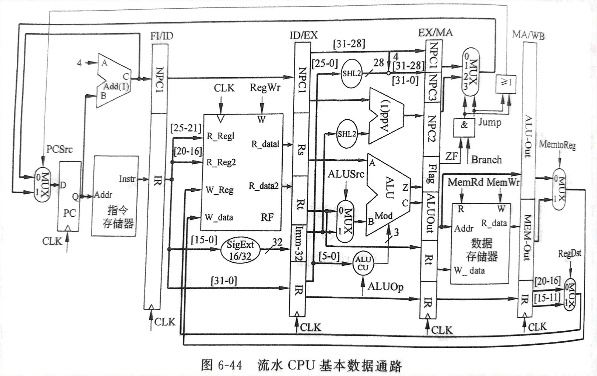
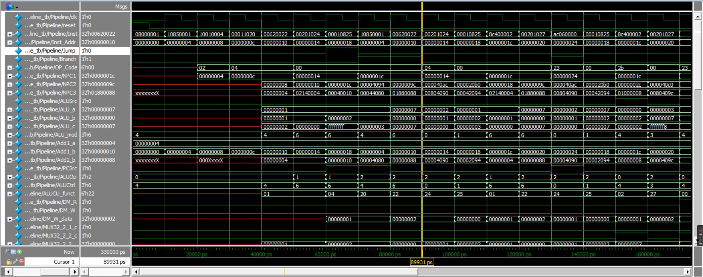

# MIPS32 流水线报告

## 数据通路

完全按照书上数据通路。编写10条流水线指令。只完成数据冒险，未完成控制冒险。

## 流水线特征
流水线将指令执行划分为多个阶段，允许同时执行不同阶段的不同指令。每个阶段负责执行指令的一个部分，从而提高指令执行的吞吐量。流水线阶段包括取指（IF）、译码（ID）、执行（EX）、访存（MEM）、写回（WB）等。多个指令可以同时在不同阶段执行，使得整个流水线处于活跃状态。

## 部件
照书上，在单周期CPU数据通路的基础上，添加FIID、IDEX、EXMA、MAWB级间部件。同时，流水线没有统一的MCU来控制信号，因此，将单周期中的MCU根据指令进行的不同阶段拆分成级间MCU。在各自的级间中，只处理可能存在的控制信号。如EX只处理ALUOp与ALUSrc，MA只处理Jump/Branch等。

+ FIID
```verilog
`timescale 1ns/1ps
module FIID (
    input clk,
    input [31:0] NPC1in,
    input [31:0] IRin,
    output reg [31:0] IRout,
    output reg [31:0] NPC1out,
    output reg [5:0] OP_Code,
    output reg [4:0] Rs,
    output reg [4:0] Rt,
    output reg [15:0] Imm16
);
    reg [31:0] Inst;
    reg [31:0] NPC1;
    always @(posedge clk ) begin
        Inst <= IRin;
        IRout <= Inst;
        NPC1 <= NPC1in;
        NPC1out <= NPC1;
        OP_Code <= Inst[31:26];
        Rs <= Inst[25:21];
        Rt <= Inst[20:16];
        Imm16 <= Inst[15:0];
    end
endmodule
```
+ IDEX

```verilog
`timescale 1ns/1ps
module IDEX (
    input clk,
    input [31:0] NPC1in,
    output reg [31:0] NPC1out,
    input [31:0] Rsin,
    input [31:0] Rtin,
    input [31:0] Imm32in,
    input [31:0] IRin,
    output reg [31:0] Rsout,
    output reg [31:0] Rtout,
    output reg [31:0] Imm32out,
    output reg [31:0] IRout
);
    reg [31:0] NPC1;
    reg [31:0] Rs;
    reg [31:0] Rt;
    reg [31:0] Imm32;
    reg [31:0] IR;
    always @(posedge clk ) begin
        NPC1 <= NPC1in;
        NPC1out <= NPC1;
        Rs <= Rsin;
        Rsout <= Rs;
        Rt <= Rtin;
        Rtout <= Rt;
        Imm32 <= Imm32in;
        Imm32out <= Imm32;
        IR <= IRin;
        IRout <= IR;
    end
endmodule
```

+ EXMA

```verilog
`timescale 1ns/1ps
module EXMA (
    input clk,
    input [31:0] NPC3in,
    output reg [31:0] NPC3out,
    input [31:0] NPC2in,
    output reg [31:0] NPC2out,
    input Flagin,
    input [31:0] Rtin,
    input [31:0] ALUOutin,
    input [31:0] IRin,
    output reg Flagout,
    output reg [31:0] Rtout,
    output reg [31:0] ALUOutout,
    output reg [31:0] IRout
);
    reg [31:0] NPC3;
    reg [31:0] NPC2;
    reg [31:0] Rt;
    reg [31:0] ALUOut;
    reg [31:0] IR;
    reg Flag;
    always @(posedge clk ) begin
        NPC3 <= NPC3in;
        NPC3out <= NPC3;
        NPC2 <= NPC2in;
        NPC2out <= NPC2;
        Rt <= Rtin;
        Rtout <= Rt;
        ALUOut <= ALUOutin;
        ALUOutout <= ALUOut;
        IR <= IRin;
        IRout <= IR;
        Flag <= Flagin;
        Flagout <= Flag;
    end
endmodule
```

+ MAWB

```verilog
`timescale 1ns/1ps
module MAWB (
    input clk,
    input [31:0] MEMOutin,
    input [31:0] ALUOutin,
    input [31:0] IRin,
    output reg [31:0] MEMOutout,
    output reg [31:0] ALUOutout,
    output reg [31:0] IRout
);
    reg [31:0] MEMOut;
    reg [31:0] ALUOut;
    reg [31:0] IR;
    always @(posedge clk ) begin
        MEMOut <= MEMOutin;
        MEMOutout <= MEMOut;
        ALUOut <= ALUOutin;
        ALUOutout <= ALUOut;
        IR <= IRin;
        IRout <= IR;
    end
endmodule
```

+ EXMCU

```verilog
`timescale 1ns/1ps
module EXMCU (
    input [31:0] Inst,
    output reg [1:0] ALUOp,
    output reg ALUSrc
);
    reg [5:0] OP_Code;
    initial begin
        OP_Code = 0;
        ALUOp = 0;
        ALUSrc = 0;
    end
    always @(*) begin
        OP_Code = Inst[31:26];
        ALUOp = 2'b00;
        ALUSrc = 0;
        case(OP_Code)
            6'b000000: begin
                ALUOp = 2'b10;
            end
            6'b100011: begin
                ALUSrc = 1;
            end
            6'b101011: begin
                ALUSrc = 1;
            end 
            6'b000100: begin
                ALUOp = 2'b01;
            end
        endcase
    end
    
endmodule
```
+ MAMCU

```verilog
`timescale 1ns/1ps
module MAMCU (
    input [31:0] Inst,
    output reg MemRd,
    output reg MemWr,
    output reg Jump,
    output reg Branch
);
    reg [5:0] OP_Code;
    initial begin
        OP_Code = 0;
        MemRd = 0;
        MemWr = 0;
        Jump = 0;
        Branch = 0;
    end
    always @(*) begin
        OP_Code = Inst[31:26];
        MemRd = 0;
        MemWr = 0;
        Jump = 0;
        Branch = 0;
        case(OP_Code)
            6'b100011: begin
                MemRd = 1;
            end
            6'b101011: begin
                MemWr = 1;
            end 
            6'b000100: begin
                Branch = 1;
            end
            6'b000010: begin
                Jump = 1;
            end
        endcase
    end
    
endmodule
```

+ WBMCU
```verilog
`timescale 1ns/1ps
module WBMCU (
    input [31:0] Inst,
    output reg RegDst,
    output reg RegWr,
    output reg MemtoReg
);
    reg [5:0] OP_Code; 
    initial begin
        OP_Code = 0;
        RegWr = 0;
        MemtoReg = 0;
        RegDst = 0;
    end
    always @(*) begin
        OP_Code = Inst[31:26];
        RegWr = 0;
        MemtoReg = 0;
        RegDst = 0;
        case(OP_Code)
            6'b000000: begin
                RegDst = 1;
                RegWr = 1;
            end
            6'b100011: begin
                RegWr = 1;
                MemtoReg = 1;
            end
        endcase
    end
    
endmodule
```

## 波形图
流水线的波形图看起来比单多周期的复杂很多。由于指令是本地存在IM中的，initial就直接读入，会发现取指令提早了一个周期。

可以发现无条件转移指令后面的指令被重复取指，这是因为我没有设置避免控制冒险的单元。我只完成了避免数据冒险：在每个级间内部暂存输入量，并将暂存量作为输出而不是直接将输入作为输出。

控制冒险导致最终寄存器内输出的结果与单多周期CPU输出的结果不尽相同。可以看到，第一条指令是无条件转移指令。在执行跳转之前，后续指令已经出现在流水线中。跳转指令之后的几条指令做出的ALU操作都是无效的。可以发现，执行跳转之后的几个周期又继续重新读取之前的指令，这样毫无疑问会造成效率的降低，同时寄存器的初值被改变了，最后运行的结果也会改变。对比最后写回的RF数据可以验证上述猜想。书P348页有避免流水线冒险的数据通路。

这个波形图太复杂了，一步步看其实没多大意义，看指令以及状态信号就可以了。由于verilog语言就是搭建电路的过程，我检查过电路连接没有问题，理论上仿真也不会出错。部件都是沿用单周期的部件，因此内部的算术逻辑运算肯定是不会出错的。所以波形我也没有细看，实在是看不下去。
