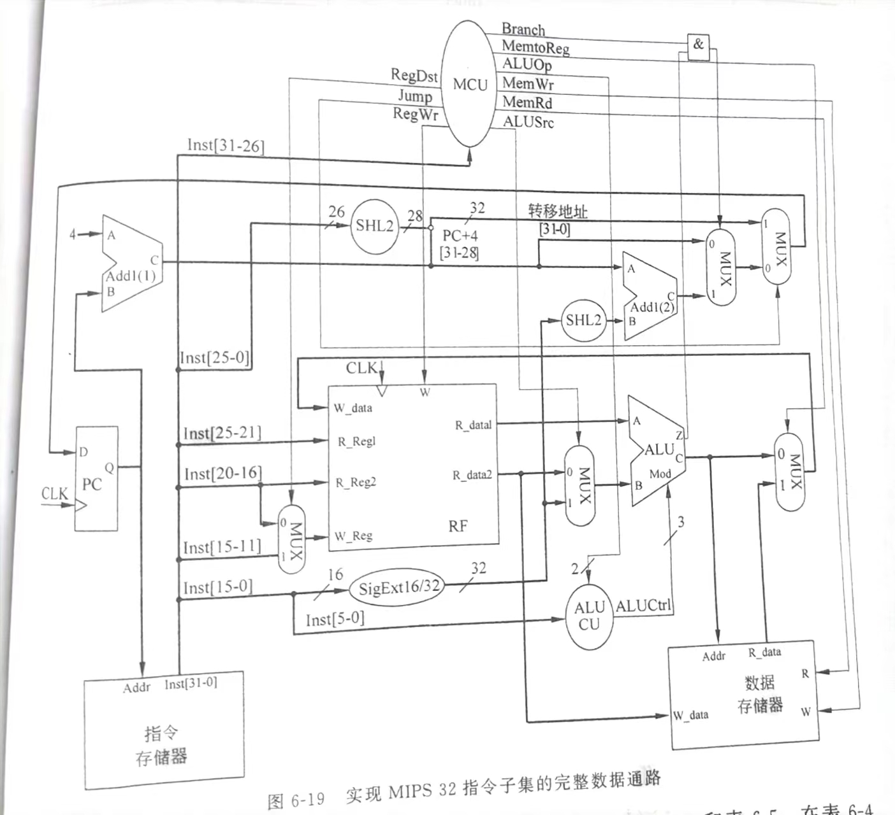
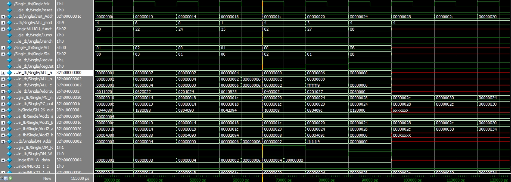
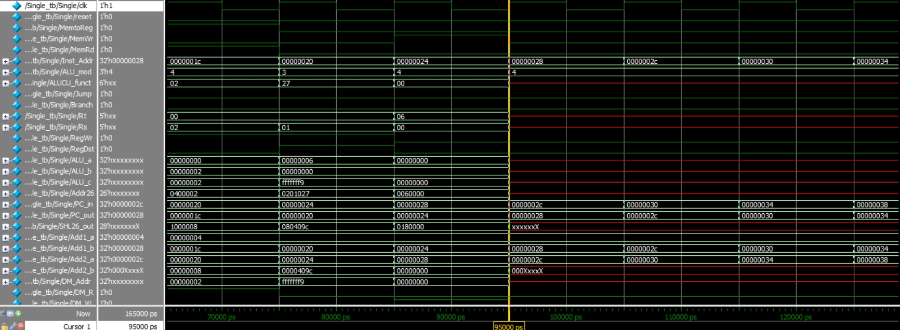

# MIPS32 单周期报告

## 数据通路

完全按照书上数据通路。编写10条单周期指令。
## 组成部件
数据与指令都存放在外部txt文件中。

+ CPU_tb
  CPU测试
  ```verilog
    `timescale 1ns/1ps
    module Single_tb (
    );
        reg clk;
        reg reset;
        integer i;
        Single Single(clk, reset);

        initial begin
            $dumpfile("D:/CPU/build/single.vcd"); 
            $dumpvars(0, Single_tb);
            clk = 0;
            reset = 1;
            # 5;
            clk = ~clk;
            # 5;
            reset = 0;
            for(i = 0;i < 31; i = i + 1) begin
                clk = ~clk;
                #5;
            end  
            $finish;
        end
    endmodule
  ```
+ CPU
  CPU数据通路
    ```verilog
    `timescale 1ns/1ps
    module Single (
        input clk,
        input reset
    );
        
        wire [31:0] RF_R_data1, RF_R_data2, RF_W_data;
        wire [31:0] Add1_a, Add1_b, Add1_c, Add2_a, Add2_b, Add2_c;   
        wire [31:0] ALU_a, ALU_b, ALU_c;    
        wire [31:0] SHL32_in, SHL32_out;
        wire [31:0] MUX32_1_i0, MUX32_1_i1, MUX32_1_out;
        wire [31:0] MUX32_2_i0, MUX32_2_i1, MUX32_2_out;
        wire [31:0] MUX32_3_i0, MUX32_3_i1, MUX32_3_out;
        wire [31:0] MUX32_4_i0, MUX32_4_i1, MUX32_4_out;
        wire [31:0] Sig32;
        wire [31:0] DM_Addr, DM_R_data, DM_W_data; 
        wire [31:0] Inst_Addr, PC_in, PC_out;
        wire [27:0] SHL26_out;
        wire [25:0] Addr26, SHL26_in;
        wire [15:0] Imm16, Sig16;
        wire [5:0] OP_Code, Func, ALUCU_funct;
        wire [4:0] RF_R_Reg1, RF_R_Reg2, RF_W_Reg;
        wire [4:0] Rs, Rt, Rd, Shamt;
        wire [4:0] MUX5_i0, MUX5_i1, MUX5_out;
        wire [2:0] ALUCtrl, ALU_mod;
        wire [1:0] ALUOp;
        wire ALUSrc, RegDst, RegWr, MemtoReg, MemRd, MemWr, Jump, Branch;
        wire RF_W, DM_R, DM_W, ALU_z, ALU_o; 
        wire MUX32_1_ctrl, MUX32_2_ctrl, MUX32_3_ctrl, MUX32_4_ctrl, MUX5_ctrl;

        assign Add1_a = 4;
        assign Add1_b = PC_out;
        assign Add2_a = Add1_c;
        assign Add2_b = SHL32_out;
        assign ALU_a = RF_R_data1;
        assign ALU_b = MUX32_3_out;
        assign ALU_mod = ALUCtrl;
        assign ALUCU_funct = Func;
        assign DM_Addr = ALU_c;
        assign DM_W_data = RF_R_data2;
        assign DM_R  = MemRd;
        assign DM_W = MemWr;
        assign Inst_Addr = PC_out;
        assign MUX5_ctrl = RegDst;
        assign MUX5_i0 = Rt;
        assign MUX5_i1 = Rd;
        assign MUX32_1_ctrl = Jump;
        assign MUX32_1_i0 = MUX32_2_out;
        assign MUX32_1_i1 = {{Add1_c[31:28]}, {SHL26_out}};
        assign MUX32_2_ctrl = Branch & ALU_z;
        assign MUX32_2_i0 = Add1_c;
        assign MUX32_2_i1 = Add2_c;
        assign MUX32_3_ctrl = ALUSrc;
        assign MUX32_3_i0 = RF_R_data2;
        assign MUX32_3_i1 = Sig32;
        assign MUX32_4_ctrl = MemtoReg;
        assign MUX32_4_i0 = ALU_c;
        assign MUX32_4_i1 = DM_R_data;
        assign PC_in = MUX32_1_out;
        assign RF_W = RegWr;
        assign RF_W_data = MUX32_4_out;
        assign RF_W_Reg = MUX5_out;
        assign RF_R_Reg1 = Rs;
        assign RF_R_Reg2 = Rt;
        assign SHL26_in = Addr26;
        assign SHL32_in = Sig32;
        assign Sig16 = Imm16;

        ADD add1(Add1_a, Add1_b, Add1_c), add2(Add2_a, Add2_b, Add2_c);
        ALU alu(ALU_a, ALU_b, ALU_c, ALU_mod, ALU_z, ALU_o);
        ALUCU alucu(ALUOp, ALUCU_funct, ALUCtrl);
        DM dm(.R_Enable(DM_R), .W_Enable(DM_W), .Addr(DM_Addr), .R_data(DM_R_data), .W_data(DM_W_data));
        IM im(Inst_Addr, OP_Code, Rs, Rt, Rd, Shamt, Func, Imm16, Addr26);
        MCU mcu(.OP_Code(OP_Code), .ALUOp(ALUOp), .ALUSrc(ALUSrc), .RegDst(RegDst), .RegWr(RegWr), .MemtoReg(MemtoReg), .MemRd(MemRd), .MemWr(MemWr), .Jump(Jump), .Branch(Branch));
        MUX5 mux5(MUX5_ctrl, MUX5_i0, MUX5_i1, MUX5_out);
        MUX32 mux32_1(MUX32_1_ctrl, MUX32_1_i0, MUX32_1_i1, MUX32_1_out);
        MUX32 mux32_2(MUX32_2_ctrl, MUX32_2_i0, MUX32_2_i1, MUX32_2_out);
        MUX32 mux32_3(MUX32_3_ctrl, MUX32_3_i0, MUX32_3_i1, MUX32_3_out);
        MUX32 mux32_4(MUX32_4_ctrl, MUX32_4_i0, MUX32_4_i1, MUX32_4_out);
        PC pc(clk, reset, PC_in, PC_out);
        RF rf(.clk(clk), .W_Enable(RF_W), .W_Reg(RF_W_Reg), .W_data(RF_W_data), .R_Reg1(RF_R_Reg1), .R_Reg2(RF_R_Reg2), .R_data1(RF_R_data1), .R_data2(RF_R_data2));
        SHL2_26 shl2_26(SHL26_in, SHL26_out);
        SHL2_32 shl2_32(SHL32_in, SHL32_out); 
        SigExt sigext(Sig16, Sig32);

    endmodule
    ```
+ MCU
  微控制单元
  ```verilog
  `timescale 1ns/1ps
  module MCU (
    input [5:0] OP_Code,
    output reg [1:0] ALUOp,
    output reg ALUSrc,
    output reg RegDst,
    output reg RegWr,
    output reg MemtoReg,
    output reg MemRd,
    output reg MemWr,
    output reg Jump,
    output reg Branch
  );
    always @(*) begin
        ALUOp = 2'b00;
        ALUSrc = 0;
        RegDst = 0;
        RegWr = 0;
        MemtoReg = 0;
        MemRd = 0;
        MemWr = 0;
        Jump = 0;
        Branch = 0;
        case(OP_Code)
            6'b000000: begin
                RegDst = 1;
                RegWr = 1;
                ALUOp = 2'b10;
            end
            6'b100011: begin
                RegWr = 1;
                ALUSrc = 1;
                MemRd = 1;
                MemtoReg = 1;
            end
            6'b101011: begin
                ALUSrc = 1;
                MemWr = 1;
            end 
            6'b000100: begin
                Branch = 1;
                ALUOp = 2'b01;
            end
            6'b000010: begin
                Jump = 1;
            end
        endcase
    end
    
  endmodule
  ```
+ ALU
  逻辑控制单元
  ```verilog
  `timescale 1ns/1ps
  module ALU (
      input [31:0] a,
      input [31:0] b,
      output reg [31:0] out,
      input [2:0] mod,
      output reg zero,
      output reg overflow
  );
      always @(*) begin
          out = 0;
          case(mod)
              3'b000: 
                  out = a & b;
              3'b001: 
                  out = a | b;
              3'b100: begin
                  out = a + b;
                  overflow = (a[31] == b[31] && out[31] != a[31]) ? 1 : 0;
              end
              3'b101:
                  out = a + b;
              3'b110: begin
                  out = a - b;
                  overflow = (a[31] != b[31] && out[31] == b[31]) ? 1 : 0;
              end
              3'b011:
                  out = ~ (a | b);
              3'b010:
                  out = (a < b) ? 1 : 0;
          endcase
          zero = (out == 0) ? 1 : 0;
      end
  endmodule
  ```
+ ALUCU
  ALU控制器
  ```verilog
  `timescale 1ns/1ps
  module ALUCU (
      input [1:0] ALUOp,
      input [5:0] funct,
      output reg [2:0] ALUCtrl
  );
      always @(*) begin
          ALUCtrl = 3'b000;
          case(ALUOp)
              2'b00:
                  ALUCtrl = 3'b100;
              2'b01:
                  ALUCtrl = 3'b110;
              default:
                  case(funct)
                      6'b100000:
                          ALUCtrl = 3'b100;
                      6'b100001:
                          ALUCtrl = 3'b101;
                      6'b100010:
                          ALUCtrl = 3'b110;
                      6'b100100:
                          ALUCtrl = 3'b000;
                      6'b100101:
                          ALUCtrl = 3'b001;
                      6'b100111:
                          ALUCtrl = 3'b011;
                      6'b101010:
                          ALUCtrl = 3'b010;
                  endcase
          endcase
      end
  endmodule
  ```
+ RF
  Regfile
  ```verilog
    `timescale 1ns/1ps
    module RF (
        input clk,
        input W_Enable,
        input [4:0] R_Reg1,
        input [4:0] R_Reg2,
        input [4:0] W_Reg,
        input [31:0] W_data,
        output [31:0] R_data1,
        output [31:0] R_data2
    );
        reg [31:0] mem[0:31];
        integer fd1, err1, i;
        
        initial begin
            $readmemb("D:/CPU/RF.txt", mem);
        end
        
        assign R_data1 = mem[R_Reg1];
        assign R_data2 = mem[R_Reg2];
        
        always @(negedge clk) begin
            if (W_Enable == 1) begin
                mem[W_Reg] = W_data;
            end

            fd1 = $fopen("D:/CPU/RF.txt");
            for (i = 0; i < 32; i = i + 1) begin
                $fdisplay(fd1, "%b", mem[i]);
                $fdisplay(fd1, "");
            end
            $fclose(fd1);
        end
    endmodule
  ```
+ DM
  DataMemory
  ```verilog
  `timescale 1ns/1ps
    module DM (
        input R_Enable,
        input W_Enable,
        input [31:0] Addr,
        input [31:0] W_data,
        output reg [31:0] R_data
    );
        reg [31:0] mem[0:31];
        integer fd1, i;

        initial begin
            $readmemb("D:/CPU/DM.txt", mem);
        end

        always @(*) begin
            if (R_Enable == 1) begin
                R_data = mem[Addr];
            end
            if (W_Enable == 1) begin
                mem[Addr] = W_data;

                fd1 = $fopen("D:/CPU/DM.txt");
                for (i = 0; i < 32; i = i + 1) begin
                    $fdisplay(fd1, "%b", mem[i]);
                end
                $fclose(fd1);
            end
        end
    endmodule
  ```
+ IM
  ```verilog
    `timescale 1ns/1ps
    module IM (
        input [31:0] Addr,
        output [5:0] OP_Code,
        output [4:0] Rs,
        output [4:0] Rt,
        output [4:0] Rd,
        output [4:0] Shamt,
        output [5:0] Func,
        output [15:0] Imm16,
        output [25:0] Addr26
    );
        reg [31:0] mem [0:31];
        reg [31:0] Inst;
        initial begin
            $readmemb("D:/CPU/IM.txt",mem);
        end
        always @(*) begin
            Inst = mem[Addr];
        end
        assign OP_Code = Inst[31:26];
        assign Rs = Inst[25:21];
        assign Rt = Inst[20:16];
        assign Rd = Inst[15:11];
        assign Shamt = Inst[10:6];
        assign Func = Inst[5:0];
        assign Imm16 = Inst[15:0];
        assign Addr26 = Inst[25:0];
    endmodule
  ```
+ PC
  ```verilog
  `timescale 1ns/1ps
  module PC (
      input clk,
      input rst,
      input [31:0] addrin,
      output reg [31:0] addrout
  );
      initial begin
          addrout = 0;
      end
      always @(posedge clk) begin
          if(rst == 1) 
              addrout = 0;
          else
              addrout = addrin;
      end
  endmodule
  ```
+ MUX5
  5位2路选择器，用于R_Reg2与W_Reg

  ```verilog
    `timescale 1ns/1ps
    module MUX5 (
        input Ctrl,
        input [4:0] i0,
        input [4:0] i1,
        output [4:0] out
    );
        always @* begin
            if (Ctrl == 0)
                out = i0;
            else
                out = i1;
        end

    endmodule
  ```
+ MUX32
  32位2路选择器
  ```verilog
    `timescale 1ns/1ps
    module MUX32_2 (
        input Ctrl,
        input [31:0] i0,
        input [31:0] i1,
        output [31:0] out
    );
        always @* begin
            if (Ctrl == 0)
                out = i0;
            else
                out = i1;
        end

    endmodule
  ```
+ SHL2_26
  ```verilog
  `timescale 1ns/1ps
  module SHL2_26 (
      input [25:0] in,
      output [27:0] out
  );
      assign out = {{in}, {2'b00}};
  endmodule
  ```
+ SHL2_32
  ```verilog
  `timescale 1ns/1ps
  module SHL2_32 (
      input [31:0] in,
      output [31:0] out
  );
      assign out = in << 2;
  endmodule
  ```
+ SigExt
  ```verilog
  `timescale 1ns/1ps
  module SigExt (
      input [15:0] in,
      output [31:0] out
  );
      assign out = {{16{1'b0}}, {in}};
  endmodule
  ```
+ ADD
  单独的加法器
  ```verilog
  `timescale 1ns/1ps
  module ADD32 (
      input [31:0] a,
      input [31:0] b,
      output [31:0] c
  );
      assign c = a + b;
  endmodule
  ```

## 指令与数据
指令IM
```
000010 00000000000000000000000001 // j 1

000100 00100 00101 0000000000000001 // beq r[4], r[5]

000100 00000 00001 0000000000000100 // beq r[0], r[1]

000000 00000 00001 00010 00000 100000 // add r[2],r[0],r[1]

000000 00011 00010 00000 00000 100010 // sub r[0],r[3],r[2]

000000 00001 00000 00010 00000 100100 // and r[2],r[1],r[0]

000000 00000 00001 00001 00000 100101 // or r[1],r[0],r[1]

100011 00010 00000 0000000000000010 // lw r[0], r[2], 2

000000 00001 00000 00010 00000 100111 // nor r[2], r[1], r[0]

101011 00000 00110 0000000000000000 // sw r[0], r[6], 0

```

寄存器RF
```
00000000000000000000000000000001

00000000000000000000000000000010

00000000000000000000000000000000

00000000000000000000000000000111

00000000000000000000000000000001

00000000000000000000000000000001

00000000000000000000000000000000

00000000000000000000000000000111
```

数据存储器DM与RF相同
```
00000000000000000000000000000001

00000000000000000000000000000010

00000000000000000000000000000000

00000000000000000000000000000111

00000000000000000000000000000001

00000000000000000000000000000001

00000000000000000000000000000000

00000000000000000000000000000111
```

## 波形图分析
所有指令都按照书P313的指令周期流程。主控制单元与ALU控制单元信号按照书P311实现。

1. 程序转移指令


首先是公操作取指令，从IM中先读出第一条指令`Jump 1`。可见Jump信号为1。进行J的移位和加法操作之后，在上升沿写入PC。

同理第二条Beq指令, `beq r[4], r[5], 1`。在RF中提前设置r[4]与r[5]都为1，故执行跳转。可见alu_zero为1，Branch信号为1。

第三条Beq指令，`beq r[0], r[1], 4`。r[0] != r[1]，故不跳转。可见alu_zero为0，Branch为0。

其中加法移位不再赘述，检查过都是对的。

2. R型指令


一连串的R型指令。`add r[2],r[0],r[1]`, `sub r[0],r[3],r[2]`, `and r[2],r[1],r[0]`, `or r[1],r[0],r[1]`。都很简单。直接核对ALU_a、ALU_b与ALU_c即可。由于都是寄存器操作，可见RegWr与RegDst信号始终为1。为了防止冲突，在下降沿写回寄存器。


3. 存储器访问指令


`lw r[0], r[2], 2`, `nor r[2], r[1], r[0]`, `sw r[0], r[6], 0`。和之前的指令没有什么特别的不同，除了用到了DM。
